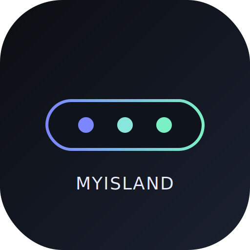
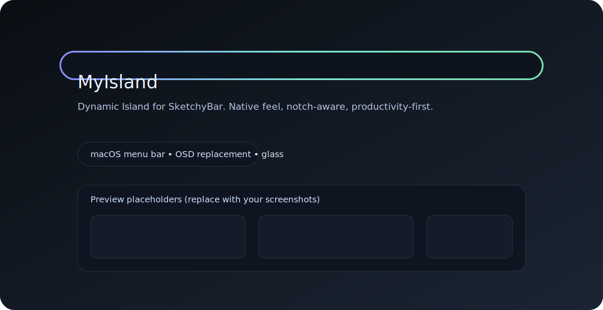
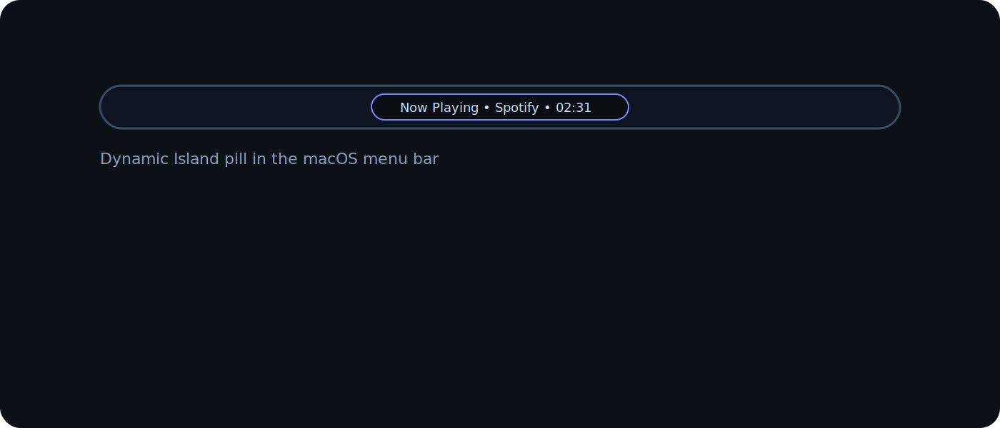
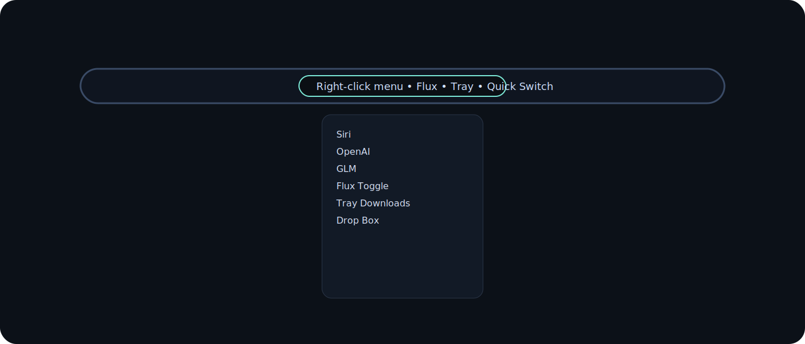
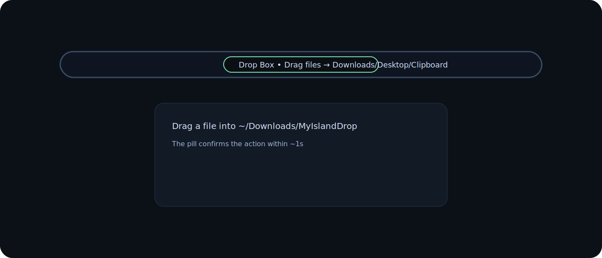

# MyIsland — macOS 菜单栏灵动岛 / Dynamic Island for SketchyBar

<p align="center">
  
</p>

**中文 | English**
- 本 README 已中英文合并，方便搜索与分享。

一句话：这是一个 **macOS 菜单栏灵动岛（Dynamic Island）** 风格的 **SketchyBar 插件**，让你的菜单栏像原生 **Siri 药丸**一样优雅，并提供 **OSD 替代**、**刘海适配**、**效率托盘**等能力。适合喜欢 **苹果 HIG**、极简 UI、玻璃拟态、菜单栏美化与 Apple Silicon 工作流的用户。

A single‑file **bilingual README** for better SEO and sharing. MyIsland is a **Dynamic Island‑style menu bar widget** for macOS, built on **SketchyBar**. It feels like a native **Siri pill** with **OSD replacement**, notch‑aware layout, and a lightweight **productivity tray**.

<p align="center">
  
</p>

---

## 关键词 / Keywords（自然融入）
macOS 灵动岛、Dynamic Island for macOS、SketchyBar 菜单栏插件、菜单栏美化、原生 UI、Apple HIG、OSD 替代、Siri 药丸、刘海 MacBook、生产力工具、玻璃拟态、菜单栏小组件、Apple Silicon workflow、menu bar widget.

---

## 亮点 / Highlights
- **刘海自适配**：notch / 非 notch 自动居中对齐。
- **Notch‑aware layout**: perfectly centered on notch and non‑notch Macs.
- **OSD 替代**：音量/亮度变化由药丸原生展示。
- **OSD replacement**: native‑feeling volume/brightness feedback.
- **右键控制中心**：Flux、托盘、快速切换、玻璃层、Agent。
- **Right‑click control center**: Flux, Tray, Quick Switch, Glass, Agent.
- **Drop Box 投递箱**：拖拽文件 → Downloads / Desktop / Clipboard / AirDrop。
- **Drop Box workflow**: drag files → Downloads / Desktop / Clipboard / AirDrop.
- **系统语言适配**：自动本地化，可手动覆盖。
- **System‑language aware**: auto‑localized with optional override.
- **安全与可控**：不自动登录、不自动验证码、不注入 cookies。
- **Manual and safe**: no auto‑login, no captcha automation, no cookie injection.

---

## 截图 / Screenshots
> 当前为占位图，保证 README 即开即看。你可以用真实截图替换 `assets/` 中同名文件即可。

**1）菜单栏灵动岛效果** / Pill in the menu bar



**2）右键菜单** / Right‑click menu (Agent / Flux / Tray / Quick Switch)



**3）Drop Box 投递箱** / Drag‑and‑drop workflow



---

## 快速开始 / Quick Start
1. 复制仓库到 `~/.config/sketchybar/`。
1. Copy this repo to `~/.config/sketchybar/`.
2. 赋予脚本执行权限：
   ```bash
   chmod +x ~/.config/sketchybar/sketchybarrc ~/.config/sketchybar/plugins/*.sh
   ```
2. Make scripts executable (same command as above).
3. 重启 SketchyBar：
   ```bash
   brew services restart sketchybar
   ```
3. Restart SketchyBar (same command as above).

可选：打开 `MyIsland.dmg`，图形化浏览与复制配置。
Optional: open `MyIsland.dmg` for a GUI copy.

---

## 操作与交互 / Controls
- **单击**：唤起 Siri / Agent。
- **Single click**: open Siri / Agent.
- **双击**：Launchpad。
- **Double click**: Launchpad.
- **滚轮**：音量（普通滚动），亮度（Shift + 滚动）。
- **Scroll**: volume (normal), brightness (Shift + scroll).
- **键盘音量/亮度**：药丸自动显示变化。
- **Keyboard volume/brightness**: pill shows changes automatically.
- **右键菜单**：设置、Flux、托盘、快速切换、玻璃层、Drop Box。
- **Right click**: Settings, Flux, Tray, Quick Switch, Glass, Drop Box.

---

## Drop Box（刘海效率托盘）
一个**安全的拖拽投递工作流**，不涉及危险自动化。
Safe drag‑and‑drop workflow without risky automation.

1. 右键菜单 → `Drop Box` 打开投递目录。
1. Right click → `Drop Box` to open the folder.
2. 右键菜单 → `Drop → Downloads/Desktop/Clipboard/AirDrop` 选择目标。
2. Right click → `Drop → Downloads/Desktop/Clipboard/AirDrop` to select a target.
3. 拖拽文件到投递目录，药丸会在 ~1 秒内确认动作。
3. Drag files in; the pill confirms within ~1s.

默认投递目录：`~/Downloads/MyIslandDrop`（可用 `USER_DROP_DIR` 自定义）。
Default folder: `~/Downloads/MyIslandDrop` (override with `USER_DROP_DIR`).

---

## Agent & AI
药丸可作为轻量菜单栏助手（可选）：
The pill can also act as a lightweight menu bar assistant:
- **Siri**（默认）
- **Siri** (default)
- **OpenAI**（使用 `OPENAI_API_KEY` 和 `OPENAI_MODEL`）
- **OpenAI** (uses `OPENAI_API_KEY` and `OPENAI_MODEL`)
- **Ironclaw / GLM**（安装后可用）
- **Ironclaw / GLM** (if installed)
- **Custom**（自定义命令）
- **Custom** (your own command)

编辑 `~/.config/sketchybar/agent.conf`（参考 `agent.conf.example`）切换 Provider 与模型。
Edit `~/.config/sketchybar/agent.conf` (see `agent.conf.example`) to switch provider and model.

---

## 配置 / Configuration
- `userconfig.example.sh` → 复制为 `userconfig.sh`，用于位置偏移、玻璃层宽度等微调。
- `userconfig.example.sh` → copy to `userconfig.sh` for offsets and glass width.
- `agent.conf.example` → 复制为 `agent.conf`，配置 Agent Provider。
- `agent.conf.example` → copy to `agent.conf` to set provider.
- `README_CONFIG.md` → 深入文档（结构与实现细节）。
- `README_CONFIG.md` → deep‑dive docs.

---

## 依赖 / Dependencies
必需：
- macOS + **SketchyBar**
- `sqlite3`, `osascript`, `curl`
- `python3`（OpenAI 请求与解析）
Required:
- macOS + **SketchyBar**
- `sqlite3`, `osascript`, `curl`
- `python3` (OpenAI payload/parse)

可选：
- `nightlight` CLI（Flux 风格夜览控制）
- `ironclaw`, `glm` 命令行（更多 Agent Provider）
- Python 自动化（若接入自定义脚本）：
  ```bash
  python3 -m pip install opencv-python pyautogui
  ```
Optional:
- `nightlight` CLI (Flux‑style Night Shift control)
- `ironclaw`, `glm` CLIs (extra providers)
- Python automation (if you wire custom scripts)

---

## 隐私与安全 / Privacy & Safety
MyIsland 只响应**用户主动行为**，不做隐式自动化，不会自动登录、自动验证码或注入 cookies。
MyIsland reacts only to explicit user actions. No auto‑login, no captcha automation, no cookie injection.

---

## 常见问题 / Troubleshooting
- **通知不显示**：给 SketchyBar 开启“完整磁盘访问”，允许读取通知数据库。
- **Notifications not showing**: grant Full Disk Access for SketchyBar to read Notification Center DB.
- **权限弹窗**：首次运行请允许 `System Events` 权限。
- **Permission prompts**: allow `System Events` when prompted.

---

## 文档 / Docs
- `README_CONFIG.md`
- `REQUIREMENTS_v2.3.md`

---

## 新版本预告 / Agent Next Evolution
**Agent vNext** 要更像原生系统助理，而不是聊天窗口：  
- **上下文感知**：理解当前应用、媒体状态、系统专注模式。  
- **多模态**：文字 + 系统 UI 状态 + 视觉上下文（需用户确认）。  
- **动作守护**：关键操作明确确认。  
- **隐私优先**：默认本地、最小化数据暴露。  

**Agent vNext** should feel like a native macOS assistant, not a chatbot:  
- **Context‑aware**: understands current app, media state, and focus mode.  
- **Multimodal**: text + UI state + visual context (user‑approved).  
- **Action‑guarded**: explicit confirmations for key actions.  
- **Privacy‑first**: local by default, minimal data exposure.  

---

## License
GPL‑3.0 (see `LICENSE`).
